# Detección de anomalías de sistemas planetarios

¡Hola! Bienvenido a mi portafolio de proyectos. En este espacio encontrarás algunos trabajos que he realizado en materias relacionadas a ciencias de datos, visión computacional, aprendizaje automático, entre otros.

---

- [Detección de anomalías de sistemas planetarios](#detección-de-anomalías-de-sistemas-planetarios)
  - [Preprocesamiento](#preprocesamiento)
  - [Análisis exploratorio](#análisis-exploratorio)
    - [Histogramas principales](#histogramas-principales)
    - [Histogramas específicos](#histogramas-específicos)
    - [Gráficas de dispersión](#gráficas-de-dispersión)
  - [Selección de parámetros](#selección-de-parámetros)
    - [IF y LOF](#if-y-lof)
    - [Autodecodificador](#autodecodificador)
  - [Resultados](#resultados)
    - [Autodecodificador](#autodecodificador-1)
  - [Conclusiones](#conclusiones)

---

## Preprocesamiento

## Análisis exploratorio

### Histogramas principales

| 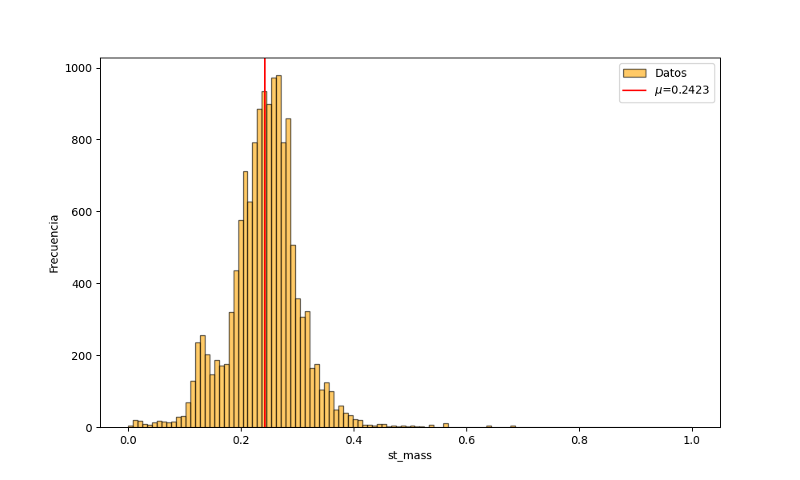 | 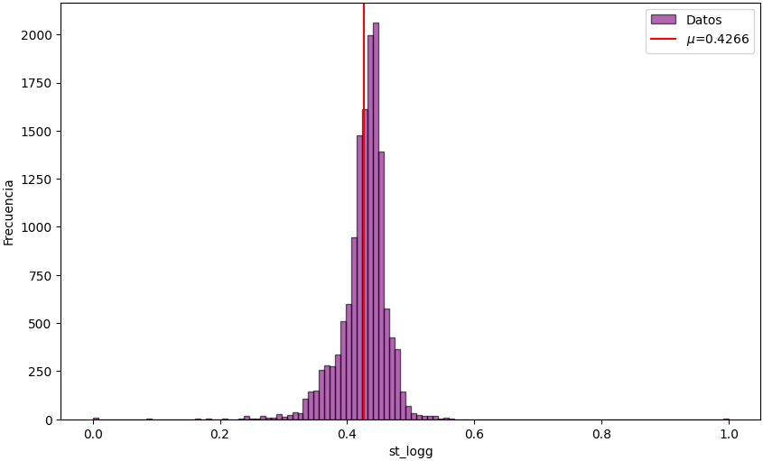 |
| ------------------------------------------------ | ------------------------------------------------ |
| (a)                                              | (b)                                              |

| 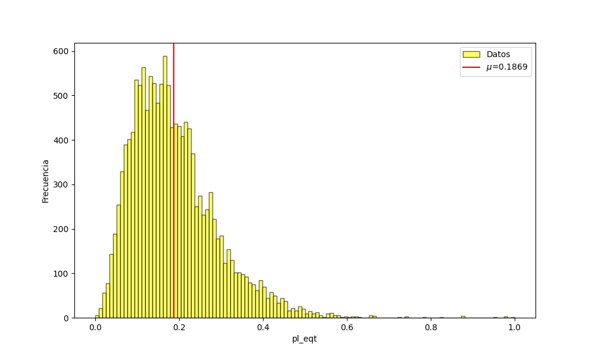 | 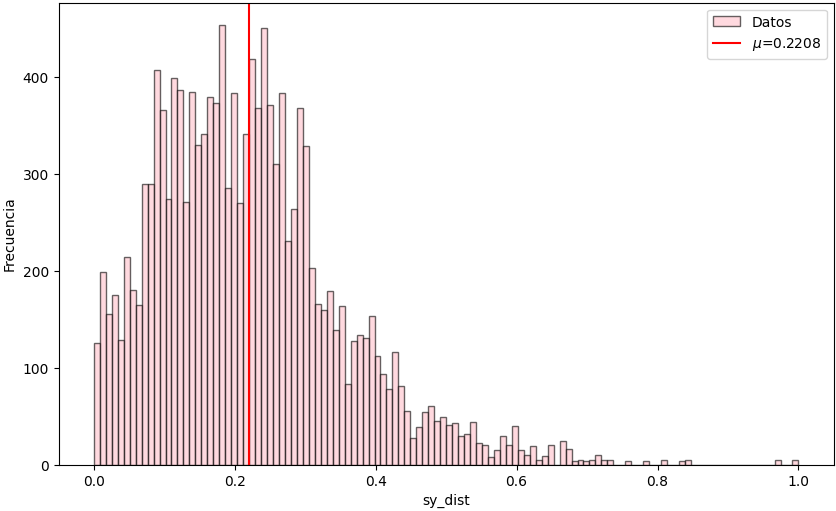 |
| ----------------------------------------------- | ------------------------------------------------ |
| (c)                                             | (d)                                              |

---

Las siguientes 3 figuras muestran una distribución rara que se revisará más a detalle.

### Histogramas específicos

| 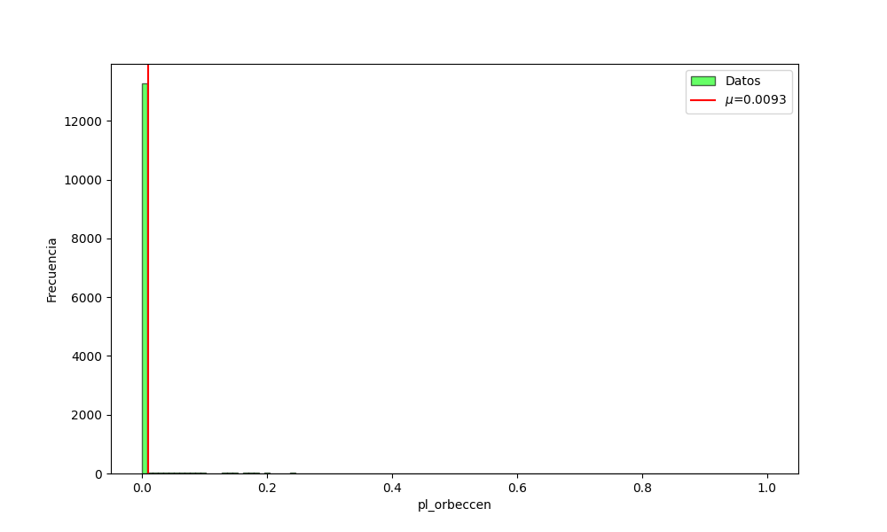 | 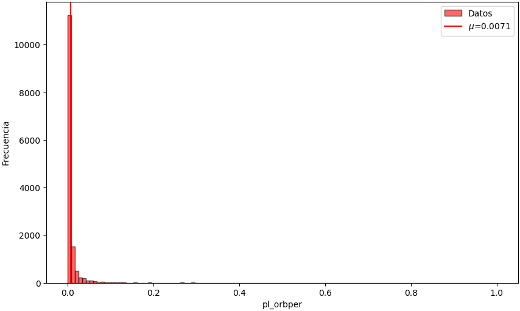 |
| ---------------------------------------------------- | -------------------------------------------------- |
| (a)                                                  | (b)                                                |

|   | 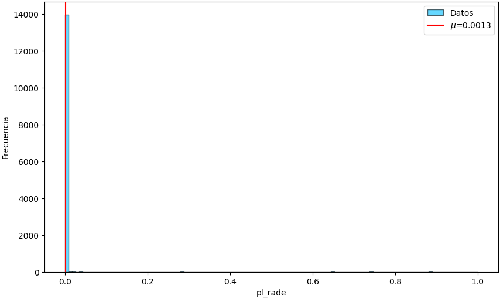 |   |
| - | ------------------------------------------------ | - |
|   | (c)                                              |   |

---

### Gráficas de dispersión

| 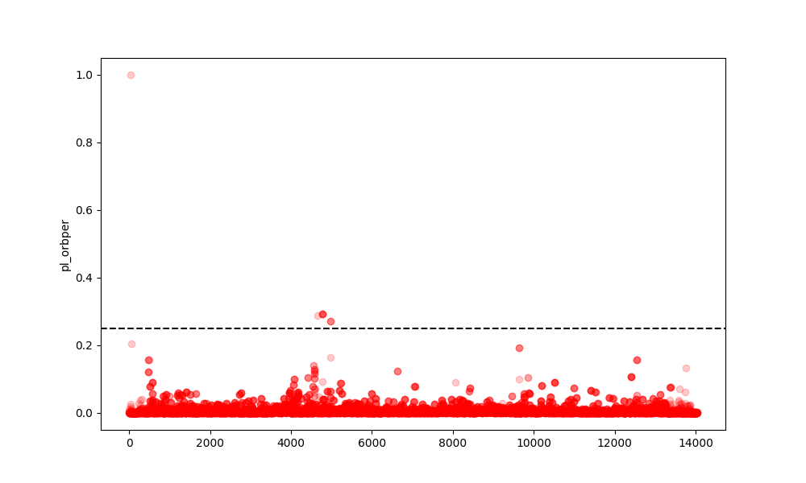 | 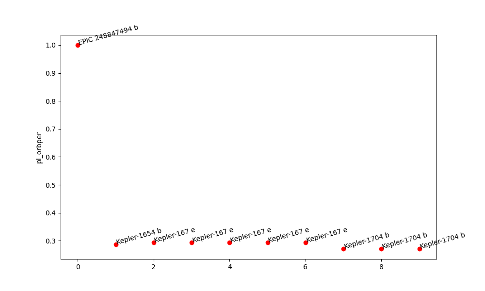 |
| ------------------------------------------------------------- | ------------------------------------------------- |
| (a)                                                           | (b)                                               |

| 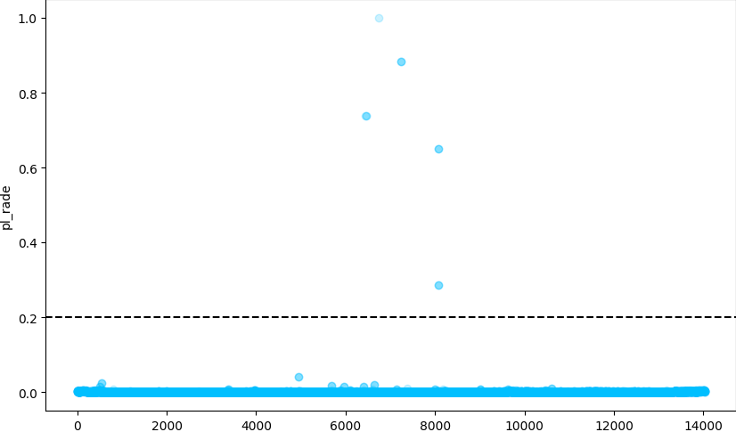 | 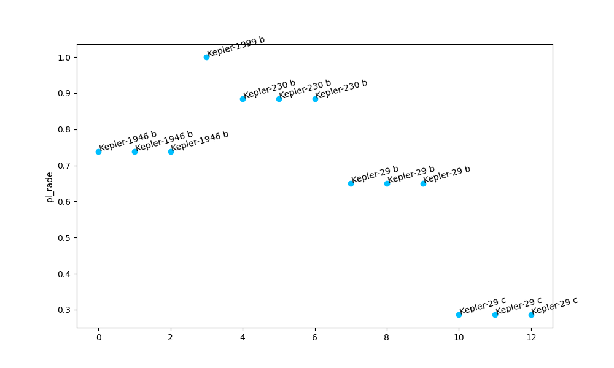 |
| ----------------------------------------------------------- | ----------------------------------------------- |
| (c)                                                         | (d)                                             |

| 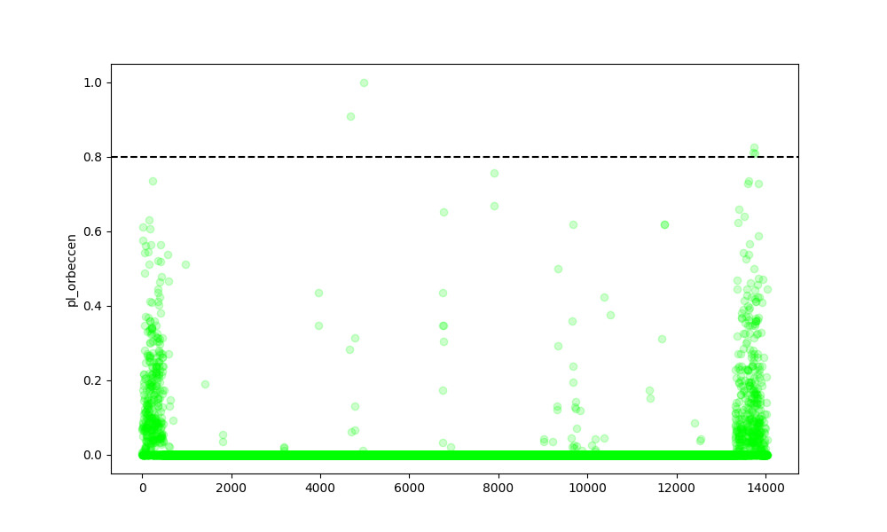 | 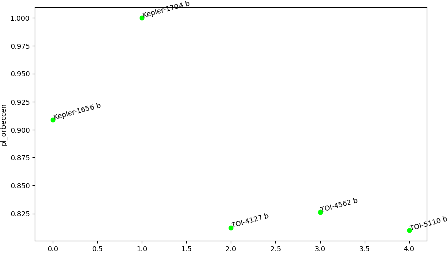 |
| --------------------------------------------------------------- | --------------------------------------------------- |
| (e)                                                             | (f)                                                 |

---

## Selección de parámetros

### IF y LOF

Para detectar las anomalías se decide trabajar con los algoritmos Isolation Forest (IF) y Local Outlier Factor (LOF).

| 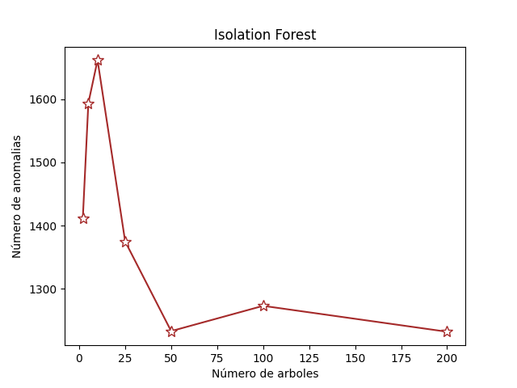 | 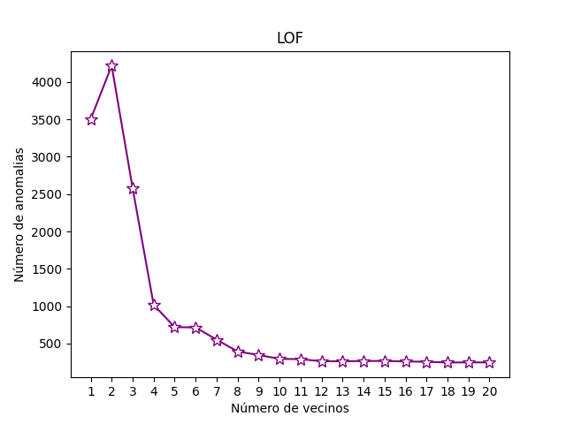 |
| -------------------------------------------------------- | ---------------------------------------------------------- |
| (a)                                                      | (b)                                                        |

---

### Autodecodificador

Se emplea autocodificador para detectar las anomalías. La arquitectura se esquematiza en la figura de la izquierda. Se emplearon funciones de activación *tanh* en las capas ocultas.
Se usa MSE como función de pérdida. El espacio latente lo podemos emplear para la representación en dos dimensiones de nuestros datos.

* 80 % de los datos se emplea para entrenamiento y 20% para pruebas.
* 100 épocas y un tamaño de batch de 32.

  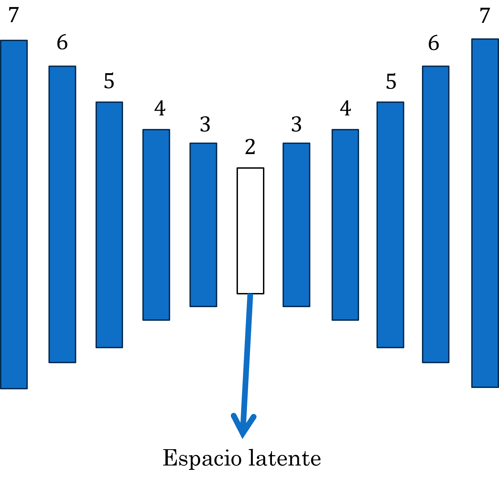

---

## Resultados

### Autodecodificador

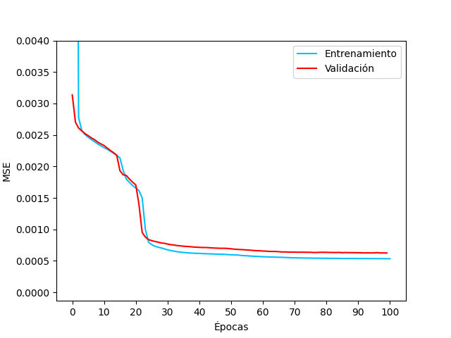

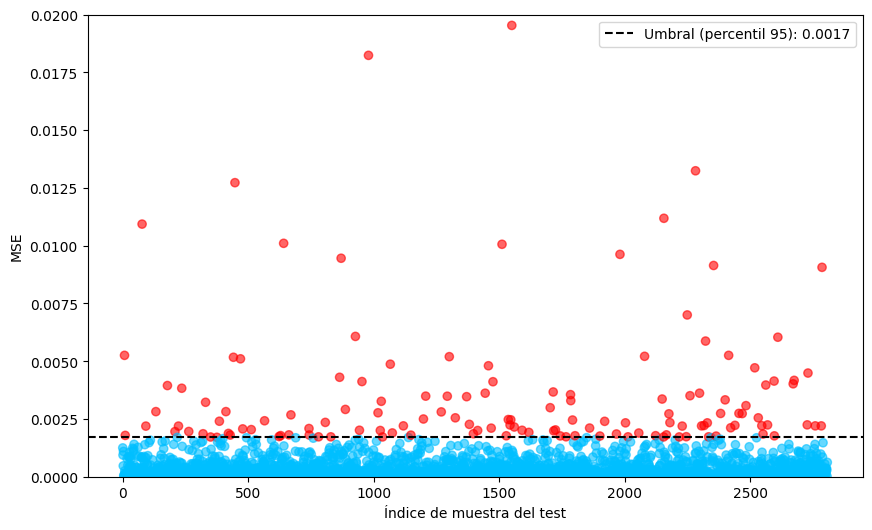

Se representan los datos mediante el espacio latente del autocodificador y también con PCA.
Se anotan algunas de las anomalías con MSE más alto.
Las estructuras de PCA y el espacio latente parecen tener semejanza.
EPIC 248847494 b aparece nuevamente.

| 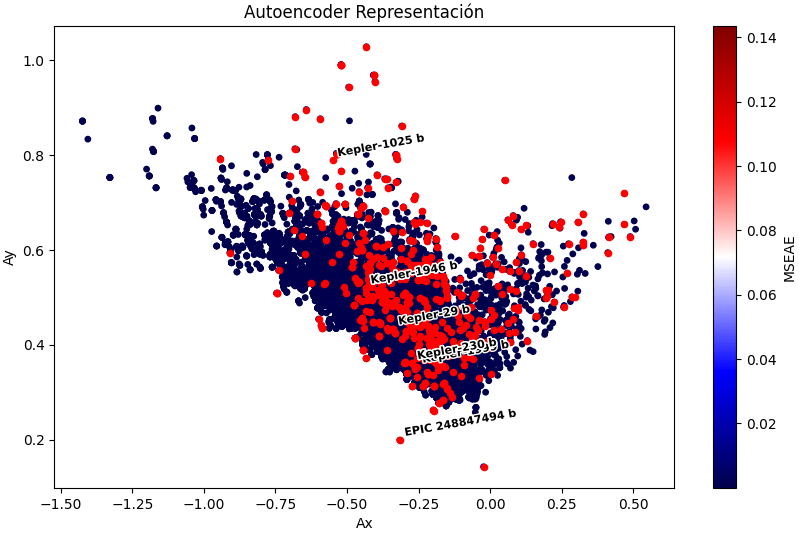 | 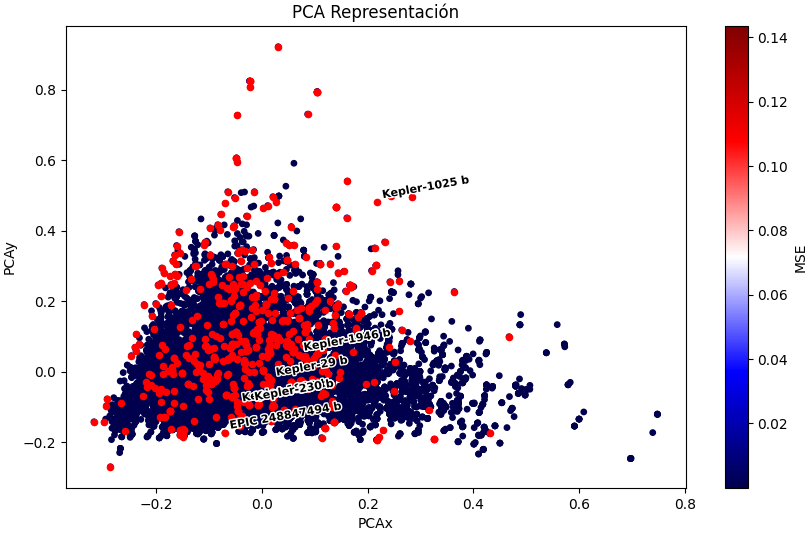 |
| ------------------------------------------------------------- | ----------------------------------------------------------- |
| (a)                                                           | (b)                                                         |

---

## Conclusiones
