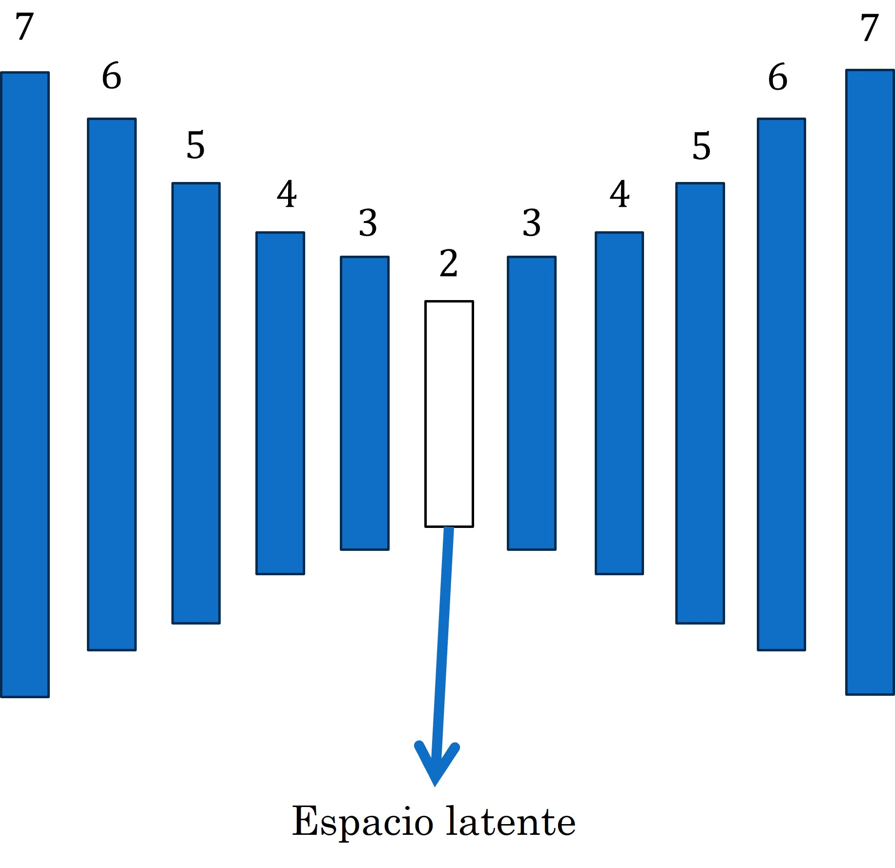
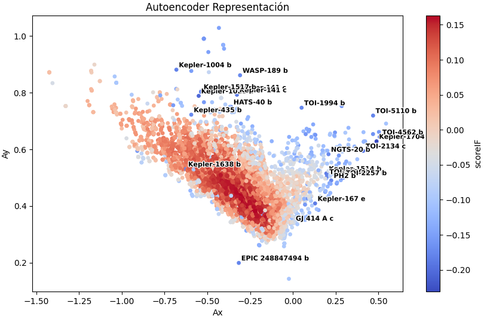
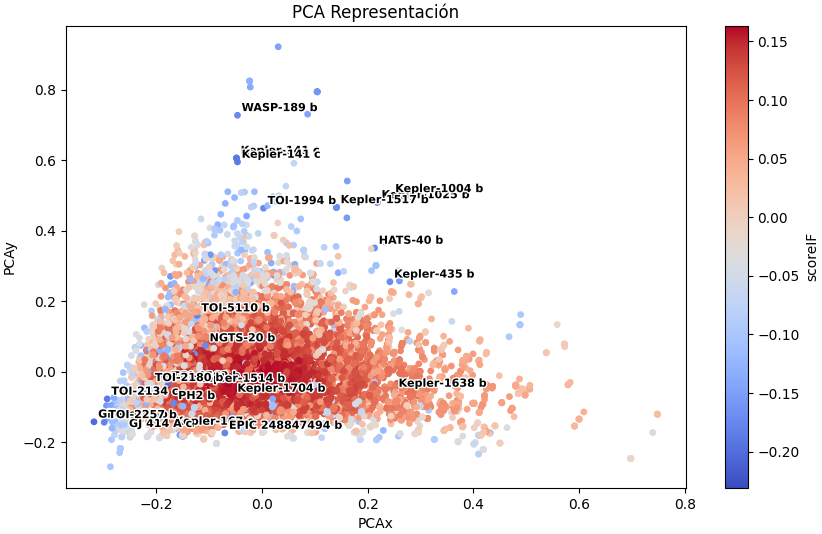
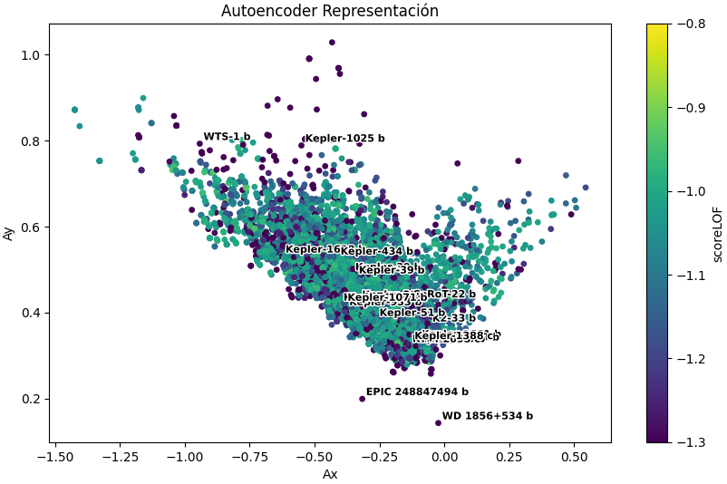
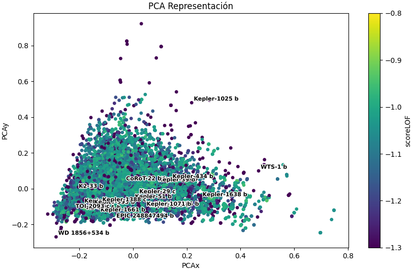
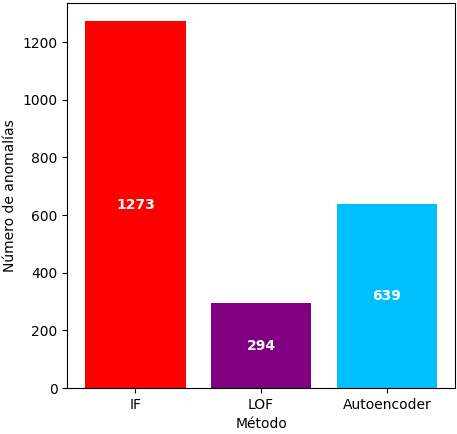
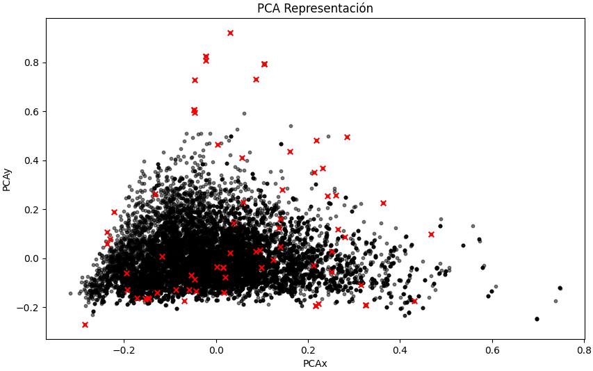
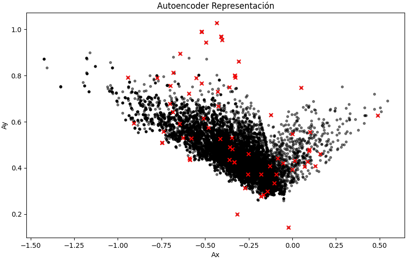

# Detección de anomalías de sistemas planetarios

---

- [Detección de anomalías de sistemas planetarios](#detección-de-anomalías-de-sistemas-planetarios)
  - [Introducción](#introducción)
  - [Preprocesamiento](#preprocesamiento)
  - [Análisis exploratorio](#análisis-exploratorio)
    - [Histogramas](#histogramas)
    - [Gráficas de dispersión](#gráficas-de-dispersión)
  - [Selección de parámetros](#selección-de-parámetros)
    - [IF y LOF](#if-y-lof)
    - [Autodecodificador](#autodecodificador)
  - [Resultados](#resultados)
    - [Autodecodificador](#autodecodificador-1)
    - [IF](#if)
    - [LOF](#lof)
    - [Anomalías detectadas](#anomalías-detectadas)
  - [Conclusiones](#conclusiones)

---

## Introducción
Se importan el conjunto de datos proveniente de [https://exoplanetarchive.ipac.caltech.edu/docs/data.html ](https://exoplanetarchive.ipac.caltech.edu/docs/data.html). En este trabajo se realizará una detección de anomalías en las mediciones de los planetas mediante algoritmos de aprendizaje automático, entre los cuales se encuentran: 

1. Isolation Forest (IF):
2. Local Outlier Factor (LOF):
3. Autodecodificadores: 

## Preprocesamiento

En dicha liga nos dirigimos a "planetary systems" y se filtran aquellos datos que no cuenten con información de: 

1. Periodo orbital (pl_orbper)
2. Radio planetario (pl_rade)
3. Excentricidad (pl_orbeccen)
4. Temperatura en equilibrio (pl_eqt)
5. Masa estelar (st_mass)
6. Gravedad estelar en superficie (st_logg)
7. Distancia a la estrella (sy_dist)

Se eliminan aquellas columnas que cuenten con valores nulos y se aplican normalización a los datos para evitar que alguna variable sea dominante respecto a las demás debido a las diferentes escalas. Después de todas estas consideraciones nuestro conjunto de datos consta de 14,037 filas y 7 columnas ya antes descritas. 

## Análisis exploratorio

### Histogramas

Para empezar a trabajar se realizan histogramas de cada una de las variables. En lo que respecta a la masa estelar, gravedad estelar en superficie y distancia a la estrella se notan distribuciones semejantes a la normal, o en dado caso con un cierto sesgo a la izquierda. 

|  |  |
| ------------------------------------------------ | ------------------------------------------------ |
| (a)  Masa estelar                                            | (b) Gravedad estelar en superficie                                              |

|  |  |
| ----------------------------------------------- | ------------------------------------------------ |
| (c) Temperatura de equilibrio                                          | (d) Distancia a la estrella                                            |

---

Por otro lado, en las siguientes figuras se muestran el resto de las variables, donde se nota claramente que hay exoplanetas que se alejan mucho del promedio, ya que cuentan con valores significativamente mayores si los comparas con el resto de los datos. A continuación se realizarán gráficos de dispersión para ver mas a detalle estas diferencias. 

|  |  |
| ---------------------------------------------------- | -------------------------------------------------- |
| (a) Excentricidad                                          | (b)Periodo orbital                                           |

|   |  |   |
| - | ------------------------------------------------ | - |
|   | (c) Radio planetario                                         |   |

---

### Gráficas de dispersión
Para tener mejor visualización de los variables restantes se opta por usar gráficas de dispersión. En ella los índices se muestran sobre el eje x mientras que en las abscisas indicamos el valor de la variable a utilizar. Seleccionamos un umbral donde se ubiquen el 95% de los datos y a partir de ellos iremos identificando exoplanetas fuera de lo común. 

|  |  |
| ------------------------------------------------------------- | ------------------------------------------------- |
| (a) Periodo Orbital                                                     | (b)  Explanetas fuera del umbral                                            |

|  |  |
| ----------------------------------------------------------- | ----------------------------------------------- |
| (c) Radio Planetario                                                    | (d) Exoplanetas fuera del umbral                                          |

|  |  |
| --------------------------------------------------------------- | --------------------------------------------------- |
| (e)   
Excentrecidad                                                          | (f) Exoplanteas fuera del umbral                                                |

En lo que respecta al periodo orbital se muestra que el exoplaneta EPIC 248847494 b tiene el valor más alto registrado, consultando el dataset corresponde a un periodo orbital de 10 años. Esto resulta relevante debido a que los métodos de observación requieren que el exoplaneta realice varios giros a la orbita para ser detectado, por lo que periodos largos necesitarían un mayor tiempo de seguimiento. 

---

## Selección de parámetros

### IF y LOF

Para detectar las anomalías se decide trabajar con los algoritmos Isolation Forest (IF) y Local Outlier Factor (LOF).

|  |  |
| -------------------------------------------------------- | ---------------------------------------------------------- |
| (a)                                                      | (b)                                                        |

---

### Autodecodificador

Se emplea autocodificador para detectar las anomalías. La arquitectura se esquematiza en la figura de la izquierda. Se emplearon funciones de activación *tanh* en las capas ocultas.
Se usa MSE como función de pérdida. El espacio latente lo podemos emplear para la representación en dos dimensiones de nuestros datos.

* 80 % de los datos se emplea para entrenamiento y 20% para pruebas.
* 100 épocas y un tamaño de batch de 32.

  

---

## Resultados

### Autodecodificador

Se representan los datos mediante el espacio latente del autocodificador y también con PCA.
Se anotan algunas de las anomalías con MSE más alto.
Las estructuras de PCA y el espacio latente parecen tener semejanza.
EPIC 248847494 b aparece nuevamente.

|  |  |
| ------------------------------------------------------------- | ----------------------------------------------------------- |
| (a)                                                           | (b)                                                         |

---

### IF
|  |  |
| ------------------------------------------------------------- | ----------------------------------------------------------- |
| (a)                                                           | (b)                                                         |

### LOF

|  |  |
| ------------------------------------------------------------- | ----------------------------------------------------------- |
| (a)                                                           | (b)                                                         |

### Anomalías detectadas

A continuación se muestra una gráfica de barras con el conteo de las anomalias por cada método empleado. Podemos observar que IF fue el sensible, mientras que el menor conteo tuvo fue LOF. El autodecodificador se quedo en un rango intermedio. 

  

Los 3 métodos detectaron tuvieron coincidencia en 79 planetas, entre los cuales se encuentran: Kepler-39 b, KELT-9 b, EPIC 248847494 b, KIC 9663113 b,HD 224018 d, Kepler-141 c, entre otros. A continuación se muestran las anomalias comunes de los 3 métodos represetnados en los espacios bidimensionales de PCA y el autodecodificador. 

|  |  |
| ------------------------------------------------------------- | ----------------------------------------------------------- |
| (a)                                                           | (b)                                                         |

## Conclusiones
Los análisis exploratorios nos pueden ayudar a darnos una idea si algún
dato se encuentra fuera de lo común.
• Se pueden emplear los autocodificadores para detectar anomalías si nos
enfocamos a analizar que tan bien se reconstruyen los datos. Mayores
errores podría indicarnos la presencia de un dato extraño.
• Escoger la arquitectura lleva su reto, ya que no parece existir una “receta”
que nos indique como armar un modelo. Se recomienda primero revisar en la
literatura si existen redes empleadas para el fenómeno que se este
analizando y no empezar desde cero.
• Los algoritmos de reducción de dimensionalidad parecen ser muy atractivos
para representar datos pero siempre hay que tener en consideración que la
salida de estos son una “sombra” de la realidad.