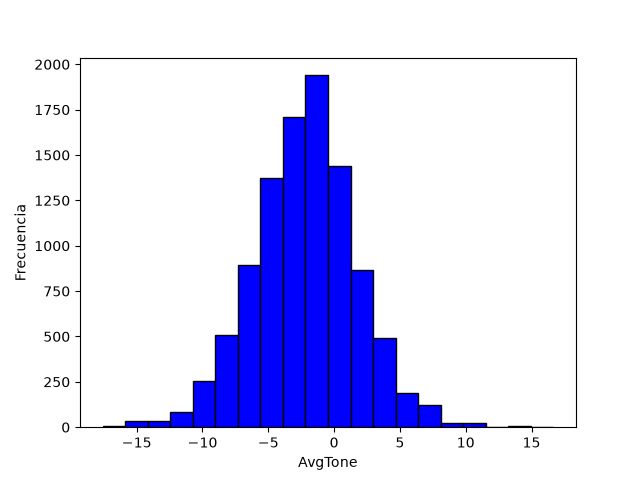
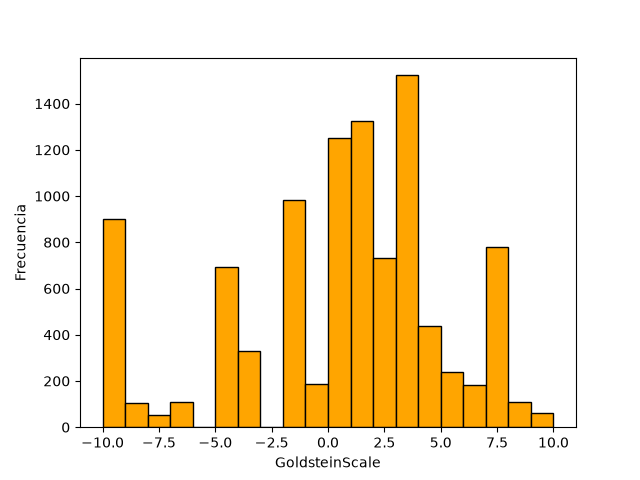
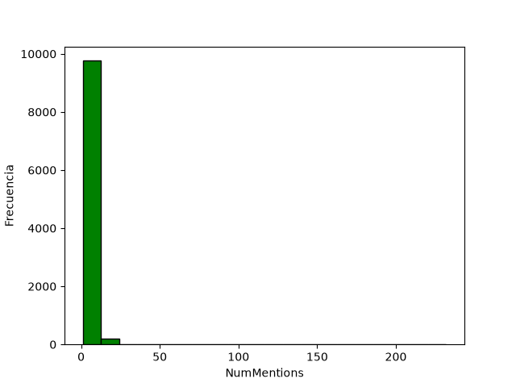
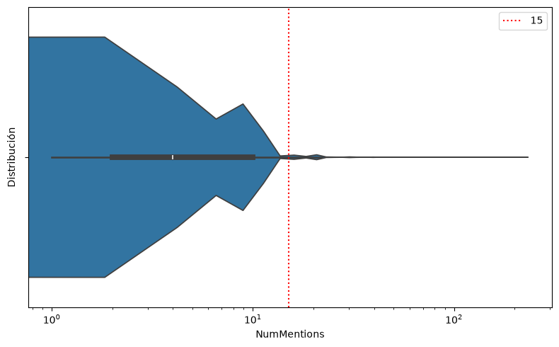
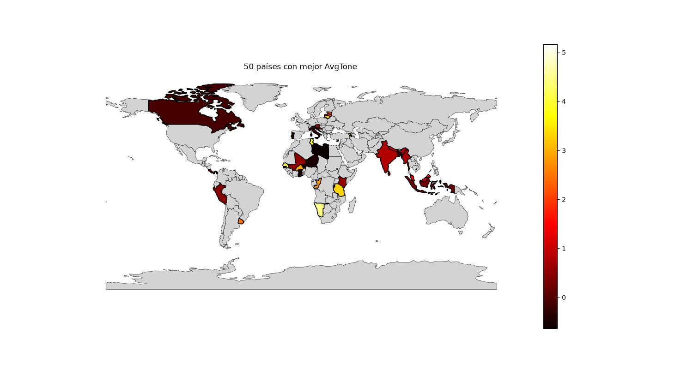
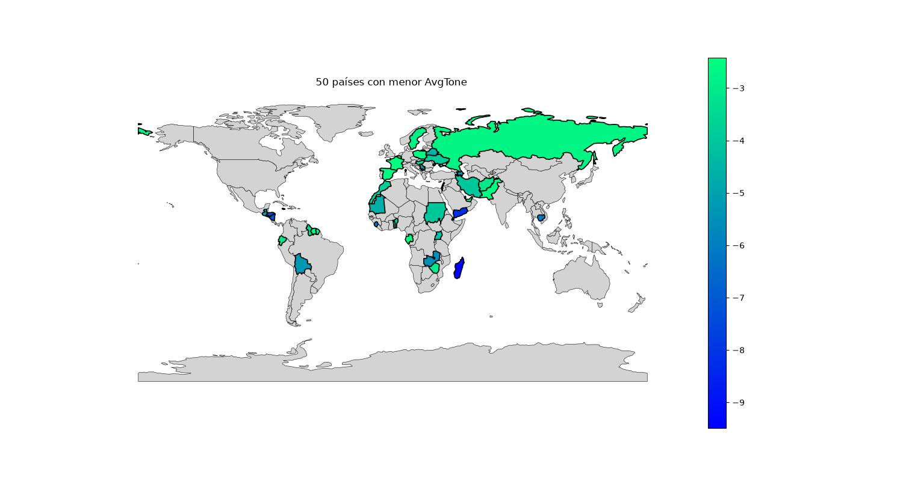
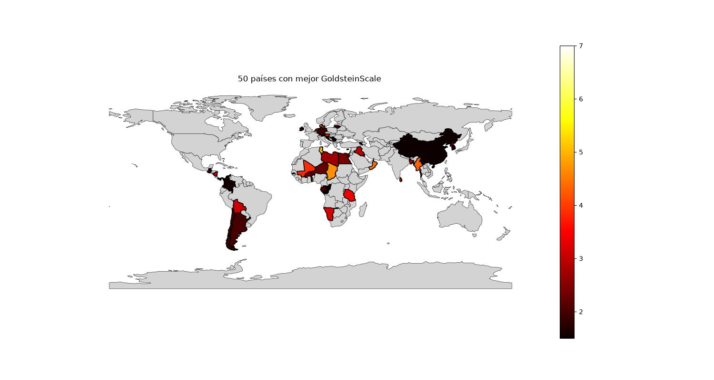
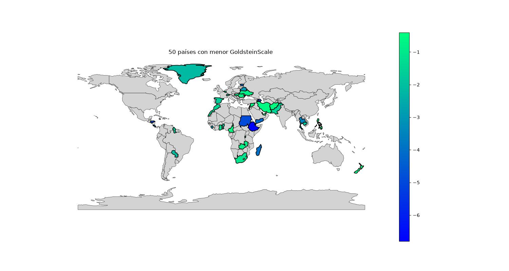

# ETL de datos GDELT

## Descripción

Este proyecto implementa un proceso **ETL (Extract, Transform, Load)** para la extracción y procesamiento de datos del proyecto **GDELT (Global Database of Events, Language, and Tone)**.

El objetivo es obtener información sobre eventos globales a partir de la base de datos de GDELT disponible en **Google BigQuery**, procesarla mediante Python y generar conjuntos de datos estructurados para su posterior análisis y visualización.


---

## Flujo del proyecto

El proceso ETL se divide en tres etapas principales:

### 1. Extract

Los datos se obtienen desde el conjunto de datos de GDELT disponible en **Google BigQuery**.

Se realizan consultas sobre la tabla de eventos para obtener información como:

* Identificador del evento.
* Fecha del evento.
* Actores involucrados.
* Código del evento.
* Escala de Goldstein (Indica que impacto tiene la noticia en el país).
* Tono promedio (Indica si la noticia es positiva o negativa).
* Número de menciones.
* País asociado al evento.
* Coordenadas geográficas.

### 2. Transform

Los datos obtenidos son procesados mediante **Pandas y NumPy**.

Durante esta etapa se realizan tareas como:

* Limpieza y preparación de los datos.
* Selección de variables relevantes.
* Tratamiento de valores faltantes.
* Transformación de tipos de datos.
* Organización de la información geográfica.
* Preparación de los datos para análisis posteriores.

### 3. Load

Los datos procesados se almacenan en formato **Parquet**, permitiendo conservar los resultados de la transformación en un formato eficiente para su posterior lectura y análisis.

---

## Estructura del proyecto

```text
ETL_GDELT/
│
├── Code/
│   └── Código fuente del proceso ETL
│
├── data/
│   ├── raw/
│   └── processed/
│
├── Notebooks/
│   └── Notebooks para exploración y visualización
│
├── Test/
│   └── Pruebas del código
│
├── Readme.md
└── Requirements.txt
```

---

## Tecnologías utilizadas

### Lenguaje

* Python

### Extracción y procesamiento de datos

* Google BigQuery
* Pandas
* NumPy
* PyArrow

### Visualización

* Matplotlib
* Seaborn
* Folium

### Análisis geoespacial

* GeoPandas

### Control de versiones

* Git
* GitHub

---

## Fuente de datos

Los datos utilizados en este proyecto provienen de **GDELT (Global Database of Events, Language, and Tone)**, una base de datos que recopila información sobre eventos y noticias de diferentes regiones del mundo.

Para la extracción se utiliza la versión de GDELT disponible a través de **Google BigQuery**.

---

## Instalación

Clona el repositorio:

```bash
git clone <URL_DEL_REPOSITORIO>
cd ETL_GDELT
```

Crea un entorno virtual:

```bash
python -m venv .venv
```

Activa el entorno virtual en Windows:

```powershell
.venv\Scripts\Activate.ps1
```

Instala las dependencias:

```bash
pip install -r Requirements.txt
```

---

## Configuración de Google BigQuery

Para ejecutar el proceso de extracción es necesario contar con un proyecto de Google Cloud y configurar las credenciales necesarias para acceder a BigQuery.

Una vez configurado el acceso, el proyecto puede utilizar el cliente de Google Cloud para ejecutar las consultas sobre el conjunto de datos de GDELT.

> **Nota:** Las credenciales y archivos sensibles no forman parte de este repositorio.

---

## Ejecución

El proceso principal puede ejecutarse desde los scripts ubicados en:

```text
Code/
```

Los notebooks ubicados en:

```text
Notebooks/
```

se utilizan principalmente para exploración de datos, análisis y visualización de los resultados generados por el proceso ETL.

---

## Resultados

El procesamiento de los datos de GDELT permite realizar diferentes análisis exploratorios sobre los eventos registrados, considerando variables como el tono de las noticias (`AvgTone`), la escala de impacto del evento (`GoldsteinScale`) y el número de menciones (`NumMentions`).

### Distribución de las variables

Se generaron histogramas para observar la distribución de las principales variables utilizadas en el análisis.

<table>
  <tr>
    <td align="center"><b>AvgTone</b></td>
    <td align="center"><b>Goldstein Scale</b></td>
    <td align="center"><b>NumMentions</b></td>
  </tr>
  <tr>
    <td align="center">
      
    </td>
    <td align="center">
      
    </td>
    <td align="center">
      
    </td>
  </tr>
</table>

Los histogramas permiten observar la distribución del tono promedio, la escala de Goldstein y el número de menciones asociados a los eventos registrados. Podemos notar que AvgTone sigue aproximadamente una distribución normal la cual tiene una media ligeramente hacia la izquierda, indicando que la mayoría de las noticias tienden a tener un tono negativo. Por otro lado `GoldsteinScale` tiene una distribución un poco mas dispersa, donde predominan las noticias que tienen mayor impacto. Por último, `NumMentions` tiene un pico demasiado grande a la izquierda, lo cual nos dice que muy pocos datos tienen valores muy extremo a la derecha, por lo cual se realizará un diagrama de violin para analizar mejor esta distribución. 

En la siguiente imagen se gráfica el diagrama de violin en escala logarítmica. Podemos notar que el 98 % de los datos se encuentran con un valor menor a 15, por lo que aquellas que superan ese numero de menciones son raras. 

<p align="center">
  
</p>


### Análisis geográfico

El siguiente ranking muestra los países con los valores promedio más altos de `AvgTone` y `GoldensteinScale` dentro del conjunto de datos analizado. La cantidad de observaciones por país debe considerarse al interpretar los resultados, ya que países con un número reducido de eventos pueden presentar promedios menos representativos.

<table>
  <tr>
    <td align="center"><b>50 países con mayor AvgTone</b></td>
    <td align="center"><b>50 países con menor AvgTone</b></td>
  </tr>
  <tr>
    <td align="center">
      
    </td>
    <td align="center">
      
    </td>
  </tr>
  <tr>
    <td align="center"><b>50 países con mayor Goldstein Scale</b></td>
    <td align="center"><b>50 países con menor Goldstein Scale</b></td>
  </tr>
  <tr>
    <td align="center">
      
    </td>
    <td align="center">
      
    </td>
  </tr>
</table>

### Mapa interactivo

También se generó un mapa interactivo para visualizar geográficamente el número de menciones (`NumMentions`) asociadas a los eventos.

El mapa se encuentra disponible como un archivo HTML:

[Ver mapa interactivo de NumMentions](Notebooks/images/heatmap_gdelt_NumMentions.html)

Ahi podemos observar que efectivamente, existen muy pocas noticias en algunos países como por ejemplo en Rusia, lo cual puede afectar significativamente el tono promedio en los mapas anteriores, haciendo que parezca que tienen noticias demasiado positivas cuando simplemente no se encuentran bien representadas en la muestra.                


